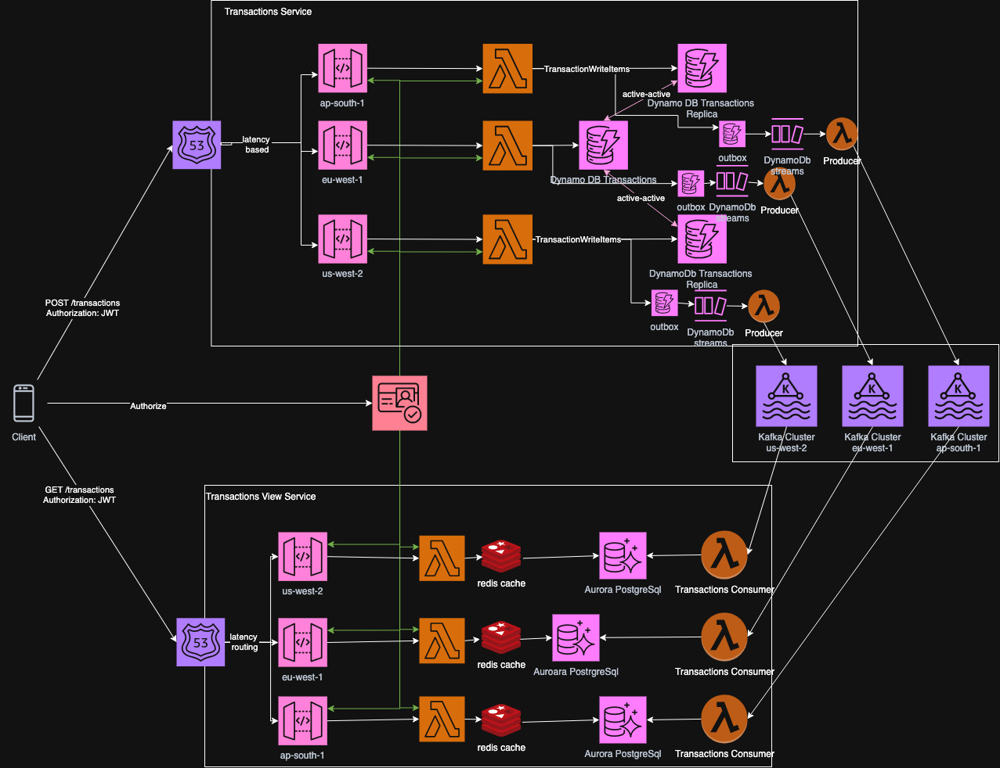
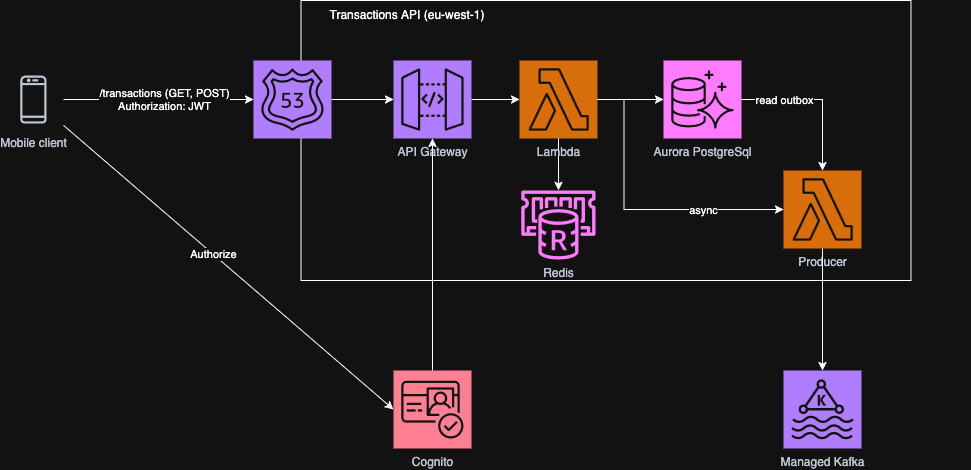

# Ahorro Platform Architecture

## High Level Architecture

- **Frontend:**
  - Flutter app (Android, iOS, Web)
  - Static web hosting via S3 + CloudFront
- **Authorization:**
  - AWS Cognito
  - Amplify library on client
- **Microservices:**
  - Users Service (APIGW + Lambda + AWS Aurora PostreSQL)
  - Transactions (APIGW + Lambda + DynamoDb)
  - Categories (CloudFront + S3 + Static Json)
  - Analytics (Athena, Redshift, Clickhouse???)
- **Message Broker:**
  - MSK Serverless (Kafka)
- **CI/CD & Infrastructure:**
  - Terraform (infrastructure as code)
  - CodeBuild (builds, pipelines)
  - Secrets Manager (secrets)
  - Route53 (DNS)
  - ACM (certificates)

---

### UI Application
- **Language:** Flutter (Dart)
- **Platforms:** Android, iOS, Web
- **Hosting:** S3 + CloudFront (Web)
- **Build & Deploy:** CodeBuild, GitHub Actions

## Microservice Architecture

### Users Service
Manage users, groups and balances.
- **Language:** Go
- **API:** REST (OpenAPI)
- **Deployment:** Route53 + API Gateway + Lambda in VPC
- **Data Store:** AWS Aurora (PostreSQL)
- **Caching:** No (initially)
- **Authentication:** Cognito JWT
- **Endpoints:**
  - Users APIs
    - `POST /users` - creates new users on app start based on JWT token info
    - `GET /users/me` - fetch user info to display
    - `PUT /users/me` - update user info
    - `DELETE /users/me` - delete user (client will not call this)
  - Groups APIs
    - `POST /groups` - create group
    - `GET /groups` - list groups the user belongs to
    - `GET /groups/{group_id}` - get group details
    - `PUT /groups/{group_id}` - update group info
    - `DELETE /grops/{group_id}` - delete group
  - Group Membership
    - `POST /groups/{group-id}/invites` - send email to target user
    - `POST /groups/join/{invite_code}` - join group by invite code
    - `GET /groups/{group_id}/invites` - list pending invites
    - `GET /groups/{group_id}/members` - list group members
    - `DELETE /groups/{group_id}/members/{user_id}` - remove user from group
- **Database:**
  - RDS (PostgreSQL)
    - `users` (user_id [PK], email, name, created_at, updated_at, status)
    - `groups` (group_id [PK], name, owner_id [FK->users], created_at, updated_at)
    - `group_members` (group_id [FK->groups], user_id [FK->users], role, joined_at, PRIMARY KEY (group_id, user_id))
    - `invites` (invite_id [PK], group_id [FK->groups], inviter_id [FK->users], invitee_email, invite_code, status, created_at, accepted_at)
    - `outbox` (id [PK], event_type, payload (JSON), status, created_at, sent_at)
- **Produces:**
  - Kafka events
    - UserCreated (user_id, email, created_at, etc)
    - UserUpdated
    - UserDeleted
    - GroupCreated (group_id, etc)
    - GroupUpdated
    - GroupDeleted
    - UserInvitedGroup (email, code)
    - UserJoinedGroup (code)
    - UserLeftGroup
- **Design Notes:**
  - Why users, groups and balances are in the same bounded context?
    - Structured data
    - Tightly coupled
    - Small team and project
    - Core user-centric features
  - Why RDS?
    - Many-to-many
    - Read heavy
    - Structured
    - Strong consistency for invites (recommended)

### Transactions Service
Manages all user transactions, their detailed entries, balances of the user and per-user category prioritization.

Below diagram shows is that ideal solution that is not going to be implemented now. The solution provides eventual consistency guarantees between write and read flows but works well for high latency and huge throughput and also scales horisontally.

The solution that will be implemented now is very simple and looks like this:

- **Language:** Go
- **API:** REST (OpenAPI)
- **Deployment:** Route53 + API Gateway + Lambda
- **Data Store:** 
  - AWS Aurora V2 + PostgreSql for transactions and balances
  - Dynamo DB for categories
- **Authentication:** Cognito JWT
- **Endpoints:**
  - Balance APIs
    - `GET /balances/{balance_id}` - list all balances for the user
    - `GET /balances/{user_id}` - list all balances for the user
    - `GET /balances/{group_id}` - list all balances for all group members
    - `POST /balances/{user_id}` - create new balance for the user
    - `PUT /balances/{balance_id}` - udpate balance information
    - `DELETE /balances/{balance_id}` - delete balance information
  - Transactions APIs
    - `POST /transactions` - create a new transaction
    - `GET /transactions` - list transactions for the user
    - `GET /transactions/{transaction_id}` - get transaction details
    - `PUT /transactions/{transaction_id}` - update transaction
    - `DELETE /transactions/{transaction_id}` - delete transaction
  - Categories APIs
    - `GET /categories/{user_id}` - returns the list of categories for the user, sorted by their personalized score
- **Transactions Fetch APIs:**
  - Various GET filtering and sorting should be supported with Pagination
    - `GET /transactions?user_id=X&type=income&category=Y&sorted_by=transacted_at` 
- **Database (PostgreSQL, Aurora V2):**
  - **balances**
    - `balance_id` UUID PRIMARY KEY
    - `user_id` UUID NOT NULL -- not a foreign key
    - `group_id` UUID NOT NULL -- not a foreign key
    - `amount` NUMERIC(18,2) NOT NULL
    - `currency` VARCHAR(8) NOT NULL
    - `created_at` TIMESTAMPTZ NOT NULL
    - `updated_at` TIMESTAMPTZ NOT NULL
  - **transactions**
    - `transaction_id` UUID PRIMARY KEY
    - `user_id` UUID NOT NULL -- not a foreign key
    - `group_id` UUID NOT NULL -- not a foreign key
    - `type` VARCHAR(16) NOT NULL -- expense, income, movement
    - `amount` NUMERIC(18,2) NOT NULL
    - `from_balance_id` UUID NOT NULL -- always the source (from) balance
    - `to_balance_id` UUID -- for movement only, destination balance
    - `category_id` UUID
    - `description` TEXT
    - `approved_at` TIMESTAMPTZ
    - `transacted_at` TIMESTAMPTZ NOT NULL
    - `created_at` TIMESTAMPTZ NOT NULL
    - `updated_at` TIMESTAMPTZ NOT NULL
    - `deleted_at` TIMESTAMPTZ
  - **outbox**
    - `id` UUID PRIMARY KEY
    - `event_type` VARCHAR(64) NOT NULL
    - `payload` JSONB NOT NULL
    - `created_at` TIMESTAMPTZ NOT NULL
- **Database (DynamoDB):**
  - **categories**
    - **Partition Key:** user_id
    - **Sort Key:** type#name
    - **LSI:** score
    - **Attributes:** user_id, name, score, type (expense/income), icon, created_at, updated_at
- **Produces (Kafka):**
  - TransactionCreated
  - TransactionUpdated
  - TransactionDeleted
  - BalanceCreated
  - BalanceUpdated
  - BalanceDeleted

**Schema Notes:**
- `user_id` and `group_id` are included for context but are not foreign keys (no enforced referential integrity).
- For movement transactions, `from_balance_id` is always the source (from) balance, and `to_balance_id` is the destination.
- Categories are now managed in a dedicated DynamoDB table, decoupled from the transactional RDS schema.
- Per-user category prioritization is managed in a separate DynamoDB table for scalability and is calculated on each request based on frequency and recency score = score * decay + increment
- All transaction writes (insert/update/delete) also insert an event into the `outbox` table for asynchronous processing.
- The outbox table is read by a background Lambda, which publishes events to MSK (Kafka) and deletes successfully sent events.
- Timestamps are stored in UTC (TIMESTAMPTZ).
- Soft deletes are implemented via `deleted_at` on transactions.

### Analytics Service
Handles analytical queries and reporting.

